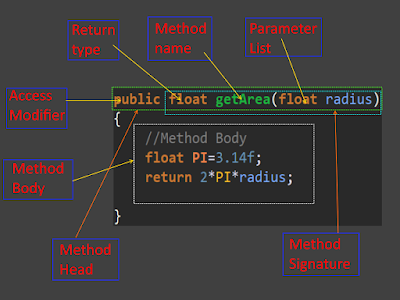

<br/>
<h4>EasyJection is an easy-to-use Dependency Injection Framework</h4>


✅ | <code><b>Quick and easy setup to get started</b></code>
:---: | :---
✅ | <code><b>Without using attributes</b></code>
✅ | <code><b>There is no need to add a Using directive to each project file that uses DI</b></code>
✅ | <code><b>Allows for much more flexible, reusable, and encapsulated code to be written</b></code>

## 🗂 Contents ##

  * [Introduction](#-introduction)
    * [What is this?](#what-is-this)
    * [Why use this?](#why-use-this)
    * [Why use it with Unity?](#why-use-it-with-unity)
  * [Key Features and Concepts](#-key-features-and-concepts)
  * [Motivation](#-motivation)
  * [Installation](#-installation)
  * [Examples](#-examples)
  * [Change Log](#-change-log)
  * [Contributing](#-contributing)
  * [License](#-license)

## 📝 Introduction ##
#### What is this? ####
EasyJection is an easy-to-use Dependency Injection (DI) Framework for *C#(.Net)* and *Unity* projects.<br/>
The framework implements dependency injection **without** using attributes. Such an implementation avoids tying your project code with the code of the framework itself and you can start using the framework without manipulating any part of your project code.
> *Since when the attributes (as well as the namespace) are used in your project's class code, that class, at least indirectly, begins to know about where it gets its dependency from.*

This project is open source.

#### Why use this? ####
If you're familiar with dependency injection and see how EasyJection could help your project, check out the [installation](#installation) and [key features](#key-features-and-concepts) to see more. If not, read on:

Dependency Injection (DI) is an intimidating word for a simple concept you're likely familiar with. Dependency Injection in simple words, is a software design concept that allows a service to be injected in a way that is completely independent of any client consumption. Dependency Injection separates the creation of a client's dependencies from the client's behavior, which allows program designs to be loosely coupled. A DI container, in pair with a good architecture, can ensure [SOLID](https://en.wikipedia.org/wiki/SOLID) principles and help you write better code.

In its simpler form it usually looks like this:
<p></p>
More details can be found here: https://en.wikipedia.org/wiki/Dependency_injection

#### Why use it with Unity? ####
Unfortunately the Unity game engine isn't very SOLID-friendly out of the box. Even the official documentation and examples for it may give a wrong idea on how to write a code correctly. By using a DI container along with Unity, it's possible to write code that is more reusable, extensible and less oriented to use the [base class](https://docs.unity3d.com/ScriptReference/MonoBehaviour.html) from which every Unity script derives.

## 🪆 Key Features and Concepts ##

  * Injection Mechanisms
    * Standard C# objects *(a.k.a. [POCO](https://en.wikipedia.org/wiki/Plain_old_CLR_object))*
      * Constructor injection
      * Method injection
      * Field injection
      * Property injection
    * Inherited from MonoBehaviour
      * Constructor injection *(as the Unity documentation says, you shouldn't implement and call constructors for MonoBehaviours. Unity automatically invokes the constructor.)*
      * Method injection *(through Awake() and Start(), or other custom methods)*
      * Field injection
      * Property injection
  * Can inject on non public members.
  * Convention based binding *(based on type name, namespace, etc.)*
  * Conditional binding *(eg. by name, by signature, etc.)*
  * Context Aware Injection Support *(dependencies can be automatically injected using the components contained in the child and parents)*

## 💡 Motivation ##
Usually, when developing a project in Unity, it's often necessary for one system of the game object to reference another. For example, a game object needs a reference to a motion component. it might look like below:

```csharp
// Cube.cs
using UnityEngine;

public class Cube : MonoBehaviour
{
    [SerializeField]
    // The dependency that provides an implementation of the rotating system.
    private IRotate m_RotateSystem;
    
    private void Update()
    {
        m_RotateSystem.DoRotate(0, 0.25f, 0);
    }
}
```
**This approach has some problems:**
- The need to always assign fields in the inspector.
- Unity doesn't support displaying C# interfaces in the Inspector (Interfaces are not serializable).

There is an attempt at a solution:
```csharp
// Cube.cs
using UnityEngine;

public class Cube : MonoBehaviour
{
    // The dependency that provides an implementation of the rotating system.
    private IRotate m_RotateSystem;
    
    private void Awake()
    {
        /* Just create a new instance (if a class doesn't inherit from MonoBehaviour)
           and pass the 'Cube' class instance through the constructor: */
        // m_RotateSystem = new Rotate(this);
        
        /* otherwise find a component like this: */
        // m_RotateSystem = GetComponentInParent<Rotate>();
        
        // or
        // m_RotateSystem = FindObjectOfType<Rotate>();
    }
    
    private void Update()
    {
        m_RotateSystem.DoRotate(0, 0.25f, 0);
    }
}
```
**This is a workable solution, but it has some disadvantages:**
- When a class holds its dependencies and tries to manage them itself without any interference from others, it's an anti-pattern named *Control Freak*.
- The need to manually write in the source code of each component. 
- Extending and maintaining the classes in your project will take a lot more effort.

So let's try dependency injection using any other existing IOC/DI framework for Unity game engine:
```csharp
// Cube.cs
using UnityEngine;
using AnyOtherDIFramework;

public class Cube : MonoBehaviour
{
    // The dependency that provides an implementation of the rotating system.
    [Inject]
    private IRotate m_RotateSystem;
    
    private void Update()
    {
        m_RotateSystem.DoRotate(0, 0.25f, 0);
    }
}
```
**It's almost perfect, but there is a snag:**
- The need to add a Using directive to the source code of your project (using AnyOtherDIFramework; in this case).
- The need to manually write attributes in the source code of each component.
- As in the previous solution, extending and maintaining the classes in your project will take a lot more effort.
- *Cube* class indirectly begins to know where it gets its dependency from.

**EaseJection was created to solve exactly these problems:**
<table>
<tr><td>Source code of the project <b>without</b> <code>using EasyJection;</code> directive.</td></tr>
<tr><td>
<details>
 <summary>Cube.cs</summary>
 
 ```csharp
// Cube.cs
using UnityEngine;

public class Cube : MonoBehaviour
{
    private IRotate m_RotateSystem;
    
    // Injection is done when this method is called.
    private void Awake() { }

    private void Update()
    {
        m_RotateSystem.DoRotate(0, 0.25f, 0);
    }
}
```
</details>
</td></tr>
<tr><td>
<details>
 <summary>IRotate.cs</summary>
 
 ```csharp
// IRotate.cs
using UnityEngine;

public interface IRotate
{
    void DoRotate(float x, float y, float z);
}
```
</details>
</td></tr>
<tr><td>
<details>
 <summary>Rotate.cs</summary>
 
 ```csharp
// Rotate.cs
using UnityEngine;

public class Rotate : IRotate
{
    private Cube m_Cube;

    public void DoRotate(float x, float y, float z)
    {
        m_Cube.transform.Rotate(x, y, z);
    }
}
```
</details>
</td></tr>
</table>

<table>
<tr><td>Source code <b>with</b> <code>using EasyJection;</code> directive.</td></tr>
<tr><td>
<details>
 <summary>EntryPoint.cs</summary>
 
 ```csharp
// EntryPoint.cs
using UnityEngine;
using EasyJection;

/*
  This is the entry point of the application, where EasyJection sets up 
  all the various dependencies before starting your game scene.
*/
public class EntryPoint
{
    [RuntimeInitializeOnLoadMethod(RuntimeInitializeLoadType.BeforeSceneLoad)]
    /* The Unity documentation mention that the order might be undefined 
       depending on platform, not sure what that means for actual usage.
 
       Methods with RuntimeInitializeLoadType.AfterSceneLoad, or RuntimeInitializeLoadType.BeforeSceneLoad 
       will only be called for the first scene in a run of the application, not every scene. */
    static void OnBeforeSceneLoadRuntimeMethod()
    {
        Container container = new Container();
        container.Binder.Bind<IRotate>().To<Rotate>();
        container.Binder.Bind<Cube>().ToSelf().ConstructionMethod("Awake");
        container.ResolveAll();
 
        /* Note: You can also create a container and set bindings in a class inherited
                 from MonoBehaviour and then add the script to the current active scene.
                 This script needs to be called first. Verify the script execution order
                 in Unity by accessing the menu: Edit->Project Settings->Script Execution Order 
                 and add the script to execute before all other scripts. Enter a large 
                 negative number to have this script before all the others on the list. */
    }
}
``` 
</details>
</td></tr>
</table>

<details>
 <summary>Attaching the script to the game object</summary>
 
</details>
 
<details>
 <summary>Result</summary>
 
</details>

As you can see, the framework does all the work of resolving the dependencies.
 
**There is also an alternative way:**
<table>
<tr><td>Source code of the project <b>without</b> <code>using EasyJection;</code> directive.</td></tr>
<tr><td>
<code>Removed Awake () method</code>
<details>
 <summary>Cube.cs</summary>
 
 ```csharp
// Cube.cs
using UnityEngine;

public class Cube : MonoBehaviour
{
    private IRotate m_RotateSystem;
 
    private void Update()
    {
        m_RotateSystem.DoRotate(0, 0.25f, 0);
    }
}
```
</details>
</td></tr>
<tr><td>
<code>no change</code>
<details>
 <summary>IRotate.cs</summary>
 
 ```csharp
// IRotate.cs
using UnityEngine;

public interface IRotate
{
    void DoRotate(float x, float y, float z);
}
```
</details>
</td></tr>
<tr><td>
<code>no change</code>
<details>
 <summary>Rotate.cs</summary>
 
 ```csharp
// Rotate.cs
using UnityEngine;

public class Rotate : IRotate
{
    private Cube m_Cube;

    public void DoRotate(float x, float y, float z)
    {
        m_Cube.transform.Rotate(x, y, z);
    }
}
```
</details>
</td></tr>
</table>

<table>
<tr><td>Source code <b>with</b> <code>using EasyJection;</code> directive.</td></tr>
<tr><td>
<code>Changed a binding for 'Cube' type with injection via the default constructor</code>
<details>
 <summary>EntryPoint.cs</summary>
 
 ```csharp
// EntryPoint.cs
using UnityEngine;
using EasyJection;

public class EntryPoint
{
    [RuntimeInitializeOnLoadMethod(RuntimeInitializeLoadType.BeforeSceneLoad)]
    static void OnBeforeSceneLoadRuntimeMethod()
    {
        Container container = new Container();
        container.Binder.Bind<IRotate>().To<Rotate>();
        container.Binder.Bind<Cube>().ToSelf(); // <-- Default constructor injection
        container.ResolveAll();
    }
}
``` 
</details>
</td></tr>
</table>

Create a game object, something like this:
```csharp
 GameObject cube = GameObject.CreatePrimitive(PrimitiveType.Cube);
 cube.AddComponent<Cube>()
```
 
**This works great too!**

>Note: Attempting to get any MonoBehaviour component inside a constructor of class 'Rotate' will throw an exception, since the injection is done via a constructor of an object inherited from MonoBehaviour.

<details>
 <summary>The code below throws an UnityException</summary>
 
```csharp
public class Rotate : IRotate
{
    private Cube m_Cube;
    private Transform m_Transform;
 
    public Rotate(Cube cube)
    {
       m_Cube = cube;
       m_Transform = cube.transform; // <-- UnityException: get_transform is not allowed to be called from a MonoBehaviour constructor (or instance field initializer), call it in Awake or Start instead. Called from MonoBehaviour 'Cube'.
    }

    public void DoRotate(float x, float y, float z)
    {
        m_Cube.transform.Rotate(x, y, z);
    }
}
```
</details>
                                            
## 🛠 Installation ##

### You can install EasyJection using any of the below options: ###
#### 🔘 Adding a line to Packages/manifest.json ####
You can use the path query parameter in the Git URL to notify the Package Manager where to find the package.
```
{
  "dependencies": {
    "com.imaxs.easyjection": "https://github.com/imaxs/EasyJection.git?path=/UnityPackage"
  }
}
```
#### 🔘 Install via UPM *(Requires Unity 2019+)* ####
`Window` ⇨ `Package Manager` ⇨ `+ sign` ⇨ `Add package from git URL`: <br/>*`https://github.com/imaxs/EasyJection.git?path=/UnityPackage`*

#### 🔘 Install manually ####
- Download the .unitypackage from [releases page](https://github.com/imaxs/EasyJection/releases)
- Import EasyJection.X.X.X.unitypackage

## 🎲 Examples ##
### DI / IoC container ###

DI container (a.k.a IoC Container) is a key feature of the dependency injection implementation. The container creates an object of the specified type and then automatically injects all the dependency objects through a constructor, property, field or method at runtime. This is done automatically by the DI (IoC) container so that you don’t have to create and manage these dependency objects manually.

```csharp
using EasyJection;
...
// Create the DI/IoC container
Container container = new Container();
```

You should call `ResolveAll()` method after all of the bindings have been set up.
```csharp
container.ResolveAll();
```

### Bindings ###
This works the same for both reference *(class)* and value *(struct)* types.
```csharp
// Binding some interface to its class implementation
container.Binder.Bind<ISomeInterface>().To<SomeClass>();
```
```csharp
// Binding some interface to its struct implementation
container.Binder.Bind<IStructInterface>().To<SomeStruct>();
```

#### Available Bindings ####

##### To Implementation Type ####
```csharp
// A new instance is created each time a dependency needs to be resolved
container.Binder.Bind<ISomeInterface>().To<SomeClass>();
```
##### To Single #####
```csharp
// A single instance of the implementation type is created
container.Binder.Bind<ISomeInterface>()
                .To<SomeClass>()
                .AsSingle();
```
##### To Self #####
```csharp
// Binding the type to the transient of itself
container.Binder.Bind<SomeClass>().ToSelf();
```
#### Conditions ####
If you don’t provide a constructor for your class, a new instance is created using the default constructor `new()`, C# creates one and sets member variables to the default values. But if you decide to create an instance through `new()` (with or without arguments) you need to provide a constructor with `[MethodImpl(MethodImplOptions.NoInlining)]` attribute. `Note that a value type (C# struct) can't have a constructor with no parameters.` Otherwise you can specify a constructor to use to instantiate your type, this is possible in several ways:
##### Passing values to a constructor #####
```csharp
// A ValueType constructor with 3 arguments (parameters). The maximum number of parameters is 9.
// Instances will be created with the specified argument values
container.Binder.Bind<Vector2>()
                .ToSelf()
                .ConstructionMethod()
                .WithArguments<int, int>(4, 2);
// or
container.Binder.Bind<ISomeInterface>()
                .To<SomeClass>()
                .ConstructionMethod()
                .WithArguments(new object[]{ "Some Text", 2021 });
```
You can pass NULL as a constructor parameter if the specific parameter is a reference type or interface. The injection will be done into constructor parameters and NULL will be changed to a value of the specific implementation contained in the container.
```csharp
// A ValueType constructor with 3 arguments (parameters). The maximum number of parameters is 9.
// Instances will be created with the specified argument values
// The injection will be done into constructor parameters
container.Binder.Bind<ISomeInterface>()
                .To<SomeClass>()
                .ConstructionMethod()
                .WithArguments<IArgumentInterface, string, int>(null, "Some Text", 2021);
```
##### Without passing values to a constructor #####
A function/method signature include parameters and their types.
```csharp
// Constructor with 1 argument (parameter). The maximum number of parameters is 9
// The injection will be done into constructor.
container.Binder.Bind<ISomeInterface>()
                .To<SomeClass>()
                .ConstructionMethod()
                .Signature<Vector2>();
```
```csharp
// Same as the above code
container.Binder.Bind<ISomeInterface>()
                .To<SomeClass>()
                .Signature<Vector2>();
```
By the name of the method that is used as the constructor. The injection will be done into an instance when this method is called. With the way Unity works, you're supposed to use *Awake()* and *Start()* instead of a constructor to handle initialization behavior.
```csharp
// A Method named "Awake"
container.Binder.Bind<MonoBehaviourGameObject>()
                .ToSelf()
                .ConstructionMethod("Awake");
```
### Injection ###
#### Injection via Constructor ####
```csharp
// The class whose instance requires dependency injection
public class AppClass
{
    // The property is set immediately when the constructor method is called.
    private ISomeInterface m_someDependence;
    
    // ❗❗❗ Specifies that the method cannot be inlined.
    [MethodImpl(MethodImplOptions.NoInlining)]
    public AppClass() { }
}
```
```csharp
// By default, injection into a class instance is done when the constructor is called.
container.Binder.Bind<AppClass>().ToSelf();
container.ResolveAll();
```
```csharp
// The instance of App type that requires dependency injection.
AppClass app = new AppClass();
```
#### Injection via the Hook method  ####
```csharp
// The class whose instance requires dependency injection
public class AppClass
{
    // The property is set immediately when the "Awake" method is called.
    private ISomeInterface m_someDependence;
    // Almost like in MonoBehaviour ;)
    public void Awake()
    {
     ...
    }
}
```
```csharp
// Specifies the name of the method performs the injection when its called.
container.Binder.Bind<AppClass>()
                .ToSelf()
                .ConstructionMethod("Awake");
container.ResolveAll();
```
```csharp
// The instance of App type that requires dependency injection.
AppClass app = new AppClass();
// Calling the method
app.Awake();
```
#### Manually Injection ####
```csharp
public class AppClass
{
    // The property is set immediately when calling DI.Inject
    private ISomeInterface m_someDependence;
}
```
```csharp
// Injection via the default constructor
container.Binder.Bind<AppClass>()
                .ToSelf()
                .ManualInjectionOnly();
container.ResolveAll();
```
```csharp
// The instance of App type that requires dependency injection
AppClass app = new AppClass();
// Injection
container.DI.Inject(app);
```
### Injection conditions ###
 
One of the most basic feature of EasyJection is adding injection call at the beginning and end of target methods/constructors. This applies to all cases, except for manual injection. As mentioned above, by default injection is done via constructor or method.

You can set the type of call sequence:
```csharp
container.Binder.Bind<IRotate>()
                .To<Rotate>()
                .Sequence(SequenceType.InjectionBeforeInstantiation);
```
The `SequenceType` enum has two value:
 - `InjectionBeforeInstantiation` — The injection is done before the actual body of the method.
 - `InjectionAfterInstantiation` — The injection is done after the actual body of the method.

By default it is set to `SequenceType.InjectionBeforeInstantiation`
 
In C# a method declaration consists of the following components as follows:

 
 
 - **Modifier** — It defines access type of the method i.e. from where it can be accessed in your application. In C# there are Public, Protected, Private access modifiers. 
 - **Name of the Method** — It describes the name of the user defined method by which the user calls it or refer it. Eg. GetName()
 - **Return type** — It defines the data type returned by the method. It depends upon user as it may also return void value i.e return nothing
 - **Body of the Method** — It refers to the line of code of tasks to be performed by the method during its execution. It is enclosed between braces.
 - **Parameter list** — Comma separated list of the input parameters are defined, preceded with their data type, within the enclosed parenthesis. If there are no parameters, then empty parentheses () have to use out.
 
## 💾 Change Log ##

All notable changes to this project will be documented in files:
 1. This [CHANGELOG](./Framework/CHANGELOG.md) includes the changes in recent updates of the framework.
 2. This [CHANGELOG](./UnityPackage/CHANGELOG.md) only contains changes specific to a package (UnityPackage).

The format is based on [Keep a Changelog](https://keepachangelog.com/en/1.0.0/) and this project adheres to [Semantic Versioning](https://semver.org/).

## 👽 Contributing ##

Found a bug or fixed it already? <br/>
You are welcome to create an issue on the project's [GitHub page](https://github.com/imaxs/EasyJection/issues) or submit a pull request.

Here's how we suggest you make changes to this project:

 - [Fork](https://help.github.com/articles/fork-a-repo/) this project to your account.
 - [Create a branch](https://help.github.com/articles/creating-and-deleting-branches-within-your-repository) for the change you intend to make.
 - Make your changes to your fork.
 - Send a [pull request](https://help.github.com/articles/using-pull-requests/) from your fork’s branch to our [`develop`](https://github.com/imaxs/EasyJection/tree/develop) branch.

## 📄 License ##

Licensed under the [Apache-2.0 License](https://www.apache.org/licenses/LICENSE-2.0). Please see [LICENSE](./LICENSE) for more information.
